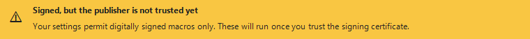

# Macro Polo

-------------------

Ever had to introduce hardening for macros in Office documents, but no one knows if a doc has a
macro in it? This is for you.

Macro Polo shows a banner under the ribbon in Word and Excel telling you three things:

1. whether the file contains macros,
2. whether they are digitally signed, and
3. **whether your settings will actually let them run**.

The third point is the one that matters, and it is not the same question as the first two. A
document can contain a perfectly ordinary macro that Office will never execute, and it can contain
an unsigned macro that runs the moment you open it because the file happens to sit in a Trusted
Location.

The banner appears on its own when you open a document containing macros — you do not have to
remember to ask. The **Macro check** toggle on the Home tab shows or hides it on demand, and works
for documents with no macros too.

## What it reports

No macros in the file:


Macros that will run the moment the file opens, unsigned — the state this add-in exists to catch:


The same, but signed:


Macros held behind the trust bar, which is Office's default behaviour:


Signed macros where your settings permit signed macros only, pending trust of the publisher:



Macros that cannot be run at all from here:


Everything the banner cannot fit — the effective macro setting, whether it is imposed by Group
Policy, and the caveat about signatures below — is in the banner's tooltip.

These images are generated from the real control by `build/Render-Banner.ps1`, so they cannot drift
out of date.

### What it accounts for

- The **macro setting** (`VBAWarnings`), resolved in the order Office itself applies:
  machine policy, then user policy, then user preference, then the Office default of *disable all
  with notification*. Reading the user's preference first — the obvious order — gets the wrong
  answer on precisely the managed machines this tool is for, because a stale preference value is
  usually still sitting in the registry underneath the policy.
- **Trusted Locations**, including the *allow subfolders* flag and the *disable all Trusted
  Locations* switch. A Trusted Location overrides the macro setting entirely.
- **Mark of the web** together with the *block macros from running in Office files from the
  Internet* policy, which cannot be overridden from inside Office.
- **Excel 4.0 (XLM) macro sheets**, which `HasVBProject` does not report and which cannot be
  signed.
- The **Office version** in use, rather than assuming Office 2016.

### What it cannot tell you

Office exposes a document's VBA signature to add-ins as a single boolean. It says a signature is
present. It does not say whether the certificate is valid, unexpired, or issued to a publisher you
trust. So "signed" here means *signed*, not *trustworthy*, and the add-in says so rather than
implying otherwise. Whether a signed macro will actually run silently depends on your Trusted
Publishers list, which is why that case is reported as "the publisher is not trusted yet".

## Installing

Download `Macro_Polo.msi` from the [latest release](../../releases/latest) and run it, or:

```bash
msiexec /i Macro_Polo.msi /qn
```

**One package covers both 32-bit and 64-bit Office.** Office reads its add-in registration from the
registry view matching its own architecture, so the installer writes both views rather than making
you match the download to your Office build. The add-in assemblies are AnyCPU and shared between
them. The package itself is x64 and needs 64-bit Windows — which is a different question from
Office's bitness.

It installs per machine, into `%ProgramFiles%\Macro Polo`, and registers each add-in under
`HKLM\SOFTWARE\Microsoft\Office\<app>\Addins` alongside the COM class registration. It is a file
copy plus registry entries — nothing else.

Options:

| | |
| --- | --- |
| `ADDLOCAL=WordAddIn` | Install only one of the two add-ins (`WordAddIn`, `ExcelAddIn`). |
| `AUTOSHOW=2` | Set the machine-wide `AutoShow` value described below. Not written unless given, because a machine-wide value overrides the user's own. |

The only prerequisite checked at install time is .NET Framework 4.7.2.

> Office keeps an add-in's DLL loaded for the life of the process. When upgrading, close every Word
> and Excel window first, or the old build stays in memory and nothing appears to change.

### No certificates

The add-ins are native COM shared add-ins rather than VSTO solutions, and that is a deliberate
choice about distribution. VSTO deploys through ClickOnce, which requires signed application and
deployment manifests: the build refuses to run without a certificate, and shipping to anyone else
means owning a code-signing identity they trust. A COM add-in is registered entirely from the
registry and has no manifests, so there is nothing to sign at any point — build, install, or load.

Signing the MSI itself with an Authenticode certificate is still worth doing if you distribute it
widely, purely to keep SmartScreen quiet. It is optional and entirely separate from whether the
add-in works.

## Configuration

Optional, under `HKLM\Software\Policies\Macro_Polo`, `HKLM\Software\Macro_Polo`, or
`HKCU\Software\Macro_Polo` (in that order of precedence):

| Value | Type | Meaning |
| --- | --- | --- |
| `AutoShow` | DWORD | `0` never show the banner automatically, `1` show it when the document has macros (default), `2` show it for every document. |
| `Logging` | DWORD | `1` writes a log to `%LOCALAPPDATA%\Macro Polo\macro-polo.log`. Off by default. |

## Building

```bash
msbuild Macro_Polo.sln -t:Restore,Build -p:Configuration=Release
```

No certificate, no signing step, and no Office developer tooling: the add-ins are ordinary class
libraries. `Macro_Polo.Core` and its tests need only the .NET SDK:

```bash
dotnet test Macro_Polo.Core.Tests\Macro_Polo.Core.Tests.csproj
```

To produce the installer:

```bash
powershell -File build\Build-Installer.ps1
```

### Checks worth knowing about

Two scripts exist because the failures they catch are invisible to the compiler and to ordinary
unit tests, and show up only as Office dying on launch:

| Script | What it catches |
| --- | --- |
| `build\Test-ComSurface.ps1` | Builds the COM callable wrapper in-process and asserts that everything Office queries for is there: IDispatch for the ribbon callbacks, the three add-in interfaces, and the ActiveX interfaces on the banner control. Runs as a gate before packaging. |
| `build\Render-Banner.ps1` | Draws the banner offscreen at every state and a range of pane widths, and writes PNGs — including the ones in this readme. Lets layout be checked without a rebuild-reinstall-restart cycle. |

The unit tests also compare the hand-written `IDTExtensibility2` declaration against the real
primary interop assembly, field marshalling included. `MarshalAs` is a pseudo-custom-attribute that
ordinary reflection cannot see, and getting it wrong crashes the host process with no managed
exception and nothing in the log.

## Layout

| Project | What it is |
| --- | --- |
| `Macro_Polo.Core` | The decision logic, registry reading, wording and banner control. No dependency on Office or the interop assemblies beyond the COM interface declaration, so it builds and tests anywhere. |
| `Shared` | The Office glue that cannot avoid those references — the COM add-in base, task pane management, the controller — compiled into both add-ins as linked source. |
| `Macro_Polo_Word`, `Macro_Polo_Excel` | Thin host adapters. Each answers only how to find the active document, how to find its window, and how to read the macro facts off it. |
| `Macro_Polo.Core.Tests` | Unit tests over the decision table, the registry precedence rules, and the COM interface declaration. |
| `Macro_Polo_Installer` | WiX project producing the per-machine MSI. |

Testing, no warranties, use at own risk, blah blah blah.
